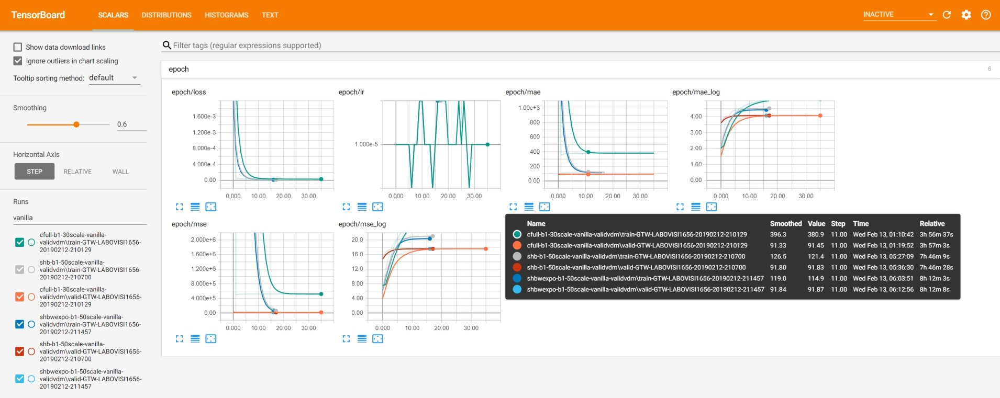

.. _user-guide:

==========
User Guide
==========

This guide provides an overview of the basic functionalities and typical use cases of the thelper
framework. For installation instructions, refer to the installation guide :ref:`[here] <install-guide>`.

Currently, the framework can be used to tackle image classification, image segmentation, object detection,
image super-resolution, and generic regression tasks. Models for all of these tasks can be trained
out-of-the-box using PyTorch. More task types are expected to follow in the future. The goal of the framework
is not to solve those problems for you; its goal is to facilitate your model exploration and development
process. This is achieved by providing a centralized interface for the control of all your experiment
settings, by offering a simple solution for model checkpointing and fine-tuning, and by providing debugging
tools and visualizations to help you understand your model's behavior. It can also help users working with
GPU clusters by keeping track of their jobs more easily. This framework will not directly give you the
perfect solution for your particular problem, but it will help you discover a solution while enforcing
good reproducibility standards.

If your problem is related to one of the aforementioned tasks, and if you can solve this problem using
a standard model architecture already included in PyTorch or in the framework itself, then you might be
able to train and export a solution without writing a single line of code. It is however typical to
work with a custom model, a custom trainer, or even a custom task/objective. This is also supported
by the framework, as most classes can be either imported as-is, or they can derive from and replace the
internal classes of the framework.

In the sections below, we introduce the framework's `Command-Line Interface (CLI) <#command-line-interface>`_
used to launch jobs, the `session configuration files <#configuration-files>`_ used to define the settings
of these jobs, and the `session directories <#session-directories>`_ that contain job outputs. Use cases that
show how to use different functionalities of the framework are available in :ref:`[a different section] <use-cases>`.

-----

Command-Line Interface
======================

The Command-Line Interface (CLI) of the framework offers the main entrypoint from which jobs are executed.
A number of different operations are supported; these are detailed in the following subsections, and
listed :ref:`[in the documentation] <thelper:thelper.cli module>`. For now, note that these operations
all rely on a configuration dictionary which is typically parsed from a JSON file. The fields of this
dictionary that are required by each operation are detailed `in the next section <#configuration-files>`_.

Note that using the framework's CLI is not mandatory. If you prefer bypassing it and creating your own
high-level job dispatcher, you can do so by deconstructing one of the already-existing CLI entrypoints,
and by calling the same high-level functions it uses to load the components you need. These might include
for example :meth:`thelper.data.utils.create_loaders` and :meth:`thelper.nn.utils.create_model`. Calling
those functions directly may also be necessary if you intend on embedding the framework inside another
application.

.. _user-guide-cli-new:

Creating a training session
---------------------------

Usage from the terminal::

  $ thelper new <PATH_TO_CONFIG_FILE.json> <PATH_TO_SAVE_DIRECTORY>

To create a training session, the ``new`` operation of the CLI is used. This redirects the execution flow
to :meth:`thelper.cli.create_session`. The configuration dictionary that is provided must contain all sections
required to train a model, namely ``datasets``, ``loaders``, ``model``, and ``trainer``. It is also mandatory
to provide a ``name`` field in the global space for the training session to be properly identified later on.

No distinction is made at this stage regarding the task that the training session is tackling. The nature
of this task (e.g. image classification) will be deduced from the ``datasets`` section of the configuration
later in the process. This CLI entrypoint can therefore be used to start training sessions for any task.

Finally, note that since starting a training session produces logs and data, the path to a directory where
the output can be created must be provided as the second argument.

.. _user-guide-cli-resume:

Resuming a training session
---------------------------

Usage from the terminal::

  $ thelper resume <PATH_TO_SESSION_DIR_OR_CHECKPT> [-m MAP_LOCATION] [-c OVERRIDE_CFG] [...]

If a previously created training session was halted for any reason, it is possible to resume it with the
``resume`` operation of the CLI. To do so, you must provide either the path to the session directory
or to a checkpoint created by the framework. If a directory path is given, it will be searched for
checkpoints and the latest one will be loaded. The training session will then be resumed using the
loaded model and optimizer state, and subsequent outputs will be saved in the original session directory.

A session can be resumed with an overriding configuration dictionary adding e.g. new metrics. If no
configuration is provided at all, the original one contained in the loaded checkpoint will be used.
Compatibility between an overriding configuration dictionary and the original one must be ensured by the
user. A session can also be resumed only to evaluate the (best) trained model performance on the testing
set. This is done by adding the ``--eval-only`` flag at the end of the command line. For more information
on the parameters, see the documentation of :meth:`thelper.cli.resume_session`.

.. _user-guide-cli-viz:

Visualizing data
----------------

Usage from the terminal::

  $ thelper viz <PATH_TO_CONFIG_FILE.json>

Visualizing the images that will be forwarded to the model during training after applying data
augmentation operations can be useful to determine whether they still look natural or not. The ``viz``
operation of the CLI allows you to do just this. It relies on the dataset parsers or data loaders
defined in a configuration dictionary that would normally be given to the CLI under the ``new`` or
``resume`` operation modes. For more information on this mode, see the documentation of
:meth:`thelper.cli.visualize_data`.

.. _user-guide-cli-annot:

Annotating data
---------------

Usage from the terminal::

  $ thelper annot <PATH_TO_CONFIG_FILE.json> <PATH_TO_SAVE_DIRECTORY>

The ``annot`` CLI operation allows the user to browse a dataset and annotate individual samples from it
using a specialized GUI tool. The configuration dictionary that is provided must contain a ``datasets``
section to define the parsers that load the data, and an ``annotator`` section that defines the GUI tool
settings used to create annotations. During an annotation session, all annotations that are created by
the user will be saved into the session directory. For more information on the parameters, refer to the
documentation of :meth:`thelper.cli.annotate_data`.

.. _user-guide-cli-split:

Split data
----------

Usage from the terminal::

  $ thelper split <PATH_TO_CONFIG_FILE.json> <PATH_TO_SAVE_DIRECTORY>

When traning a model, the framework will typically split the datasets into non-overlapping data loaders.
This split must be performed every time a training session is created or resumed. This can be a lengthy
process based on the amount of preprocessing and parsing required by the dataset constructors. Using the
``split`` CLI operation allows the user to pre-compute this split and archive the training, validation,
and test sets into a HDF5 archive. This archive can then be parsed by an interface provided in the
framework to speed up the creation/resuming of training sessions, or simply for external tests. See
:class:`thelper.data.parsers.HDF5Dataset` for more information on the dataset interface, or
:meth:`thelper.cli.split_data` on the operation itself.

.. _user-guide-cli-export:

Export model
------------

Usage from the terminal::

  $ thelper export <PATH_TO_CONFIG_FILE.json> <PATH_TO_SAVE_DIRECTORY>

The ``export`` CLI operation allows the user to export a trained model for external use as defined in
a configuration file. The export format is a new checkpoint that may optionally contain an optimized
version of the model compiled using PyTorch's JIT engine. This is still an experimental feature. See
the documentation of :meth:`thelper.cli.export_model` or the :ref:`[example here] <use-cases-model-export>`
for more information.

`[to top] <#user-guide>`_

-----

Configuration Files
===================

Configuration files are at the heart of the framework. These essentially contain all the settings that
might affect the behavior of a training session, and therefore of a trained model. The framework itself
does not enforce that all parameters must be passed through the configuration file, but it is good to
follow this principle, as it helps enforce reproducibility. Configuration files also essentially always
contain a dictionary so that parameters can be split into sections. We thus often refer to them as
'configuration dictionaries'.

The framework will automatically skips sections of the configuration file that it does not need to use or
that it does not understand. This is useful when sections or subsections are added for custom needs, or
when only a portion of the configuration is relevant to some use case (for example, the 'visualization'
mode of the CLI will only look at the datasets and data loaders sections).

For now, all configuration files are expected to be in JSON format, but future versions of the framework
will support YAML configurations as well as raw python modules (.py files) that define each subsection
as a dictionary. Examples of complete configuration files used for various purposes are available in the
``config`` directory located with the code (`[see them here]`__).

.. __: https://github.com/plstcharles/thelper/tree/master/configs

Datasets section
----------------

The ``datasets`` section of the configuration defines the dataset "parsers" that will be instantiated by
the framework and passed to the data loaders. These are responsible for parsing the structure of a
dataset and providing the total number of samples that it contains. Dataset parsers should expose a
``__getitem__`` function that returns an individual data sample when queried by index. The dataset parsers
provided in the ``torchvision.datasets`` package are all fully compatible with these requirements.

The configuration section itself should be built like a dictionary of objects to instantiate. The key
associated with each parser is the name that will be used to refer to it internally as well as in the
``loaders`` section. If a dataset parser that does not derive from :class:`thelper.data.parsers.Dataset`
is needed, you will have to specify a task object inside its definition. An example configuration based on
the CIFAR10 class provided by ``torchvision`` (`[more info here]`__) is shown below::

    "datasets": {
        "cifar10_train": {  # name of the first dataset parser
            "type": "torchvision.datasets.CIFAR10",  # class to instantiate
            "params": {  # parameters forwarded to the class constructor
                "root": "data/cifar/train",
                "train": true,
                "download": true
            },
            "task": {  # task defined explicitely due to external type
                "type": "thelper.tasks.Classification",
                "params": { # by default, we just need to know the class names
                    "class_names": [
                        "airplane", "car", "bird", "cat", "deer",
                        "dog", "frog", "horse", "ship", "truck"
                    ],
                    # torchvision loads samples as tuples; we map the indices
                    "input_key": "0",  # input = element at index#0 in tuple
                    "label_key": "1"   # label = element at index#1 in tuple
                }
            }
        },
        "cifar10_test": {  # name of the second dataset parser
            "type": "torchvision.datasets.CIFAR10",  # class to instantiate
            "params": {  # parameters forwarded to the class constructor
                "root": "data/cifar/test",
                "train": false,  # here, fetch test data instead of train data
                "download": true
            },
            "task": {
                # we use the same task info as above, both will be merged
                "type": "thelper.tasks.Classification",
                "params": {
                    "class_names": [
                        "airplane", "car", "bird", "cat", "deer",
                        "dog", "frog", "horse", "ship", "truck"
                    ],
                    "input_key": "0",
                    "label_key": "1"
                }
            }
        }
    }

.. __: https://pytorch.org/docs/stable/torchvision/datasets.html#torchvision.datasets.CIFAR10

The example above defines two dataset parsers, ``cifar10_train`` and ``cifar10_test``, that can now
be referred to in the ``loaders`` section of a configuration file (`described next <#loaders-section>`_).
For more information on the instantiation of dataset parsers, refer to
:meth:`thelper.data.utils.create_parsers`.

Loaders section
---------------

The ``loaders`` section of the configuration defines all data loader-related settings including split
ratios, samplers, batch sizes, base transforms and augmentations, seeds, memory pinning, and async
worker count. The first important concept to understand here is that multiple data parsers (`defined
earlier <#datasets-section>`_) can be combined or split into one or more data loaders. Moreover, there
are exactly three data loaders defined for all experiments: the training data loader, the validation data
loader, and the test data loader. For more information on the fundamental role of each loader, see
`[this link]`__. In short, data loaders deal with parsers to load and transform data samples efficiently
before packing them into batches that we can feed our models.

.. __: https://towardsdatascience.com/train-validation-and-test-sets-72cb40cba9e7

Some of the settings defined in this section apply to all three data loaders (e.g. memory pinning, base
data transforms), while others can be specified for each loader individually (e.g. augmentations, batch
size). The meta-settings that should always be set however are the split ratios that define the fraction
of samples from each parser to use in a data loader. As shown in the example below, these ratios allow
us to split a dataset into different loaders automatically, and without any possibility of data leakage
between them. If all RNG seeds are set in this section, then the split will be reproducible between
experiments. The split can also be precomputed using the ``split`` operation of the CLI (`click here
for more information <#split-data>`_).

Besides, base transformations defined in this section are used to ensure that all samples loaded by
parsers are compatible with the input format expected by the model during training. For example, typical
image classification pipelines expect images to have a resolution of 224x224 pixels, with each color
channel normalized to either the [-1, 1] range, or using pre-computed mean and standard deviation values.
We can define such operations directly using the classes available in the :mod:`thelper.transforms`
module. This is also demonstrated in the example configuration below::

    # note: this example is tied with the "datasets" example given earlier
    "loaders": {
        "batch_size": 32,     # pack 32 images per minibatch (for all loaders)
        "test_seed": 0,       # fix the test set splitting seed
        "valid_seed": 0,      # fix the validation set splitting seed
        "torch_seed": 0,      # fix the PyTorch RNG seed for tranforms/augments
        "numpy_seed": 0,      # fix the numpy RNG seed for transforms/augments
        "random_seed": 0,     # fix the random package RNG seed for transforms/augments
        # note: non-fixed seeds will be initialized randomly and printed in logs
        "workers": 4,         # each loader will be loading 4 minibatches in parallel
        "base_transforms": [  # defines the operations to apply to all loaded samples
            {
                # first, normalize 8-bit images to the [-1, 1] range
                "operation": "thelper.transforms.NormalizeMinMax",
                "params": {
                    "min": [127, 127, 127],
                    "max": [255, 255, 255]
                }
            },
            {
                # next, resize the CIFAR10 images to 224x224 for the model
                "operation": "thelper.transforms.Resize",
                "params": {
                    "dsize": [224, 224]
                }
            },
            {
                # finally, transform the opencv/numpy arrays to torch.Tensor arrays
                "operation": "torchvision.transforms.ToTensor"
            }
        ],
        # we reserve 20% of the samples from the training parser for validation
        "train_split": {
            "cifar10_train": 0.8
        },
        "valid_split": {
            "cifar10_train": 0.2
        },
        # we use 100% of the samples from the test parser for testing
        "test_split": {
            "cifar10_test": 1.0
        }
    }

The example above prepares the CIFAR10 data using a 80%-20% training-validation split, and keeps all
the original CIFAR10 testing data for actual testing. All loaded samples will be normalized and resized
to fit the expected input resolution of a typical model, as shown in the next subsection. This example
however contains no data augmentation pipelines; refer to the :ref:`[relevant sections here]
<use-cases-dataset-augment>` for actual usage examples. Similarly, no sampler is
used above to rebalance the classes; :ref:`[see here] <use-cases-dataset-rebalance>` for a use case.
Finally, for more information on other parameters that are not discussed here, refer to the documentation
of :meth:`thelper.data.utils.create_loaders`.

Model section
-------------

The ``model`` section of the configuration defines the model that will be trained, fine-tuned, evaluated,
or exported during the session. The model can be defined in several ways. If you are creating a new model
from scratch (i.e. using randomly initialized weights), you simply have to specify the type of the class
that implements the model's architecture along with its constructor's parameters. This is shown in the
example below for an instance of MobileNet::

    "model": {
        "type": "thelper.nn.mobilenet.MobileNetV2",
        "params": {
            "input_size": 224
        }
    }

In this case, the constructor of :class:`thelper.nn.mobilenet.MobileNetV2` will only receive a single
argument, ``input_size``, i.e. the size of the tensors it should expect as input. Some implementations
of model architectures such as those in ``torchvision.models`` (`[see them here]`__) might allow you
to specify a ``pretrained`` parameter. Setting this parameter to ``True`` will let you automatically
download the weights of that model and thus allow you to fine-tune it directly::

    "model": {
        "type" : "torchvision.models.resnet.resnet18",
        "params": {
            "pretrained": true
        }
    }

.. __: https://pytorch.org/docs/stable/torchvision/models.html

The second option to fine-tune a model that is not available via ``torchvision`` is to specify the
path to a checkpoint produced by the framework as such::

    "model": {
        "ckptdata" : "<PATH_TO_ANY_THELPER_CHECKPOINT.pth>"
    }

When using this approach, the framework will first open the checkpoint and reinstantiate the model using
its original fully qualified class name and the parameters originally passed to its constructor. Then,
that model will be checked for task compatibility, and its weights will finally be loaded in. For more
information on the checkpoints produced by the framework, see the `[relevant section below] <#checkpoints>`_.
For more information on the model creation/loading process, refer to :meth:`thelper.nn.utils.create_model`.

Trainer section
---------------

The ``trainer`` section of the configuration defines trainer, optimization, and metric-related settings
used in a session. These settings include the type of trainer to use, the number of epochs to train for,
the list of metrics to compute during training, the name of the metric to continuously monitor for
improvements, the loss function to use, the optimizer, the scheduler, and the device (CUDA or CPU) that
the session should be executed on.

First, note here that the type of trainer that is picked must be compatible with the task(s) exposed
by the dataset parser(s) listed earlier in the configuration. If no trainer type is provided, the
framework will automatically deduce which one to use for the current task. This deduction might fail
for custom trainers/task combinations. If you are using a custom task, or if your model relies on multiple
loss functions (or any other similar exotic thing), you might have to create your own trainer implementation
derived from :class:`thelper.train.base.Trainer`. Otherwise, see the trainers module (:mod:`thelper.train`)
for a list of all available trainers.

All optimization settings are grouped into the ``optimization`` subsection of the ``trainer`` section.
While specifying a scheduler is optional, an optimizer and a loss function must always be specified.
The loss function can be provided via the typical type/params setup (as shown below), or obtained from
the model via a getter function. For more information on the latter option, see
:meth:`thelper.optim.utils.create_loss_fn`. On the other hand, the nature of the optimizer and
scheduler can only be specified via a type/param setup (as also shown below). The weights of the model
specified in the last section will always be passed as the first argument of the optimizer's 
constructor at runtime. This behavior is compatible with all optimizers defined by PyTorch (`[more info
here]`__).

.. __: https://pytorch.org/docs/stable/optim.html

The ``trainer`` section finally contains another subsection titled ``metrics``. This subsection defines
a dictionary of named metrics that should be continuously updated during training, and evaluated at the
end of each epoch. Numerous types of metrics are already implemented in :mod:`thelper.optim.metrics`,
and many more will be added in the future. Metrics typically measure the performance of the model based
on a specific criteria, but they can also do things like save model predictions and create graphs. A
special "monitored" metric can also be defined in the ``trainer`` section, and it will be used to
determine whether the model is improving or not during the training session. This is used to keep track
of the "best" model weights while creating checkpoints, and it might also be used for scheduling.

A complete example of a trainer configuration is shown below::

    "trainer": {
        # this example is in line with the earlier examples; we create a classifier
        "type": "thelper.train.ImageClassifTrainer",  # type could be deduced automatically
        "device": "cuda:all",   # by default, run the session on all GPUs in parallel
        "epochs": 50,           # run the session for a maximum of 50 epochs
        "save_freq": 1,         # save the model in a checkpoint every epoch
        "monitor": "accuracy",  # monitor the 'accuracy' metric defined below for improvements
        "use_tbx": true,        # activate tensorboardX metric logging in output directory
        "optimization": {
            "loss": {
                "type": "torch.nn.CrossEntropyLoss",
                "params": {}    # empty sections like these can be omitted
            },
            "optimizer": {
                "type": "torch.optim.RMSprop",
                "params": {
                    "lr": 0.01, # default learning rate used at the first epoch
                    "weight_decay": 0.00004
                }
            },
            "scheduler": {
                # here, we create a fancy scheduler that will check a metric for its steps
                "type": "torch.optim.lr_scheduler.ReduceLROnPlateau",
                "params": {
                    "mode": "max",   # since we will monitor accuracy, we want to maximize it
                    "factor": 0.1,   # when a plateau is detected, decrease lr by 90%
                    "patience": 3    # wait three epochs with no improvement before stepping
                },
                # now, we just name the metric defined below for the scheduler to use
                "step_metric": "accuracy"
            }
        },
        "metrics": {  # this is the list of all metrics we will be evaluating
            "accuracy": {  # the name of each metric should be unique
                "type": "thelper.optim.CategoryAccuracy",
                "params": {
                    "top_k": 1
                }
            },
            "confmat": {
                # this is a special metric used to create confusion matrices
                # (we can't monitor this one, as it does not return a scalar)
                "type": "thelper.optim.ConfusionMatrix"
            }
        },
        "test_metrics": {  # metrics in this section will only be used for testing
            "logger": {
                "type": "thelper.optim.ClassifLogger",
                "params": {
                    "top_k": 3
                }
            }
        }
    }

For more information on the metrics available in the framework, see :mod:`thelper.optim.metrics`.

Annotator section
-----------------

The ``annotator`` section of the configuration is used solely to define GUI-related settings during
annotation sessions. For now, it should only contain the type and constructor parameters of the GUI
tool that will be instantiated to create the annotations. An example is shown below::

    "annotator": {
        "type": "thelper.gui.ImageSegmentAnnotator",  # type of annotator to instantiate
        "params": {
            "sample_input_key": "image",  # this key is tied to the data parser's output
            "labels": [
                # for this example, we only use one brush type that draws using solid red
                {"id": 255, "name": "foreground", "color": [0, 0, 255]}
            ]
        }
    }

In this case, an image segmentation GUI is created that will allow the "image" loaded in each sample
to be annotated by user with a brush tool. This section (as well as all GUI tools) are still
experimental. For more information on annotators, refer to :mod:`thelper.gui.annotators`.

Global parameters
-----------------

Finally, session configurations can also contain global parameters located outside the main sections
detailed so far. For example, the session name is a global flag which is often mandatory as it is used
to identify the session and create its output directory. Other global parameters are used to change the
behavior of imported package, or are just hacky solutions to problems that should be fixed otherwise.

For now, the global parameters considered "of interest" are the following:

  - ``name`` : specifies the name of the session (mandatory in most operation modes).
  - ``cudnn_benchmark`` : specifies whether to activate/deactivate cuDNN benchmarking mode.
  - ``cudnn_deterministic`` : specifies whether to activate/deactivate cuDNN deterministic mode.

Future global parameters will most likely be handled via :meth:`thelper.utils.setup_globals`.

`[to top] <#user-guide>`_

-----

Session Directories
===================

If the framework is used in a way that requires it to produce outputs, they will always be located
somewhere in the "session directory". This directory is created in the root output directory provided
to the CLI (also often called the "save" directory), and it is named after the session itself. The
session directory contains three main folders that hold checkpoints, logs, and outputs. These are
discussed in the following subsections. The general structure of a session directory is shown below::

    <session_directory_name>
      |
      |-- checkpoints
      |     |-- ckpt.0000.<platform>-<date>-<time>.pth
      |     |-- ckpt.0001.<platform>-<date>-<time>.pth
      |     |-- ckpt.0002.<platform>-<date>-<time>.pth
      |     |-- ...
      |     \-- ckpt.best.pth
      |
      |-- logs
      |     |-- <dataset1-name>.log
      |     |-- <dataset2-name>.log
      |     |-- ...
      |     |-- config.<platform>-<date>-<time>.json
      |     |-- data.log
      |     |-- modules.log
      |     |-- packages.log
      |     |-- task.log
      |     \-- trainer.log
      |
      |-- output
      |     \-- <session_directory_name>
      |           |-- train-<platform>-<date>-<time>
      |           |     |-- events.out.tfevents.<something>.<platform>
      |           |     \-- ...
      |           |
      |           |-- valid-<platform>-<date>-<time>
      |           |     |-- events.out.tfevents.<something>.<platform>
      |           |     \-- ...
      |           |
      |           |-- test-<platform>-<date>-<time>
      |           |     |-- events.out.tfevents.<something>.<platform>
      |           |     \-- ...
      |           |
      |           \-- ...
      |
      \-- config.latest.json

Checkpoints
-----------

The ``checkpoints`` folder contains the binary files pickled by PyTorch that store all training data
required to resume a session. These files are automatically saved at the end of each epoch during
a training session. The checkpoints are named using the ``ckpt.XXXX.YYYYY-ZZZZZZ-ZZZZZZ.pth`` convention,
where ``XXXX`` is the epoch index (0-based), ``YYYYY`` is the platform or hostname, and ``ZZZZZZ-ZZZZZZ``
defines the date and time of their creation (in YYYYMMDD-HHMMSS format). All checkpoints created by the
framework during training will use this naming convention except for the ``best`` checkpoint that might
be created in monitored training sessions (as part of early stopping and for final model evaluation). In
this case, it will simply be named ``ckpt.best.pth``. Its content is the same as other checkpoints however,
and it is actually just a copy of the corresponding "best" checkpoint in the same directory.

Checkpoints can be opened directly using ``torch.load()``. They contain a dictionary with the following
fields:

  - ``name`` : the name of the session. Used as a unique identifier for many types of output.
  - ``epoch`` : the epoch index (0-based) at the end of which the checkpoint was saved. This value is
    optional, and may only be saved in training sessions.
  - ``iter`` : the total number of iterations computed so far in the training session. This value is
    optional, and may only be saved in training sessions.
  - ``source`` : the name of the host that created the checkpoint and its time of creation.
  - ``sha1`` : the sha1 signature of the framework's latest git commit. Used for debugging purposed only.
  - ``version`` : the version of the framework that created this checkpoint. Will be used for data and
    configuration file migration if necessary when reloading the checkpoint.
  - ``task`` : a copy or string representation of the task the model was being trained for. Used to
    keep track of expected model input/output mappings (e.g. class names).
  - ``outputs`` : the outputs (e.g. metrics) generated by the trainer for all epochs thus far. This object
    is optional, and may only be saved in training sessions.
  - ``model`` : the weights (or "state dictionary") of the model, or a path to where these weights may be
    found. This field can be used to hold a link to an external JIT trace or ONNX version of the model.
  - ``model_type`` : the type (or class name) of the model that may be used to reinstantiate it.
  - ``model_params`` : the constructor parameters of the model that may be used to reinstantiate it.
  - ``optimizer`` : the state of the optimizer at the end of the latest training epoch. This value is
    optional, and may only be saved in training sessions.
  - ``scheduler`` : the state of the scheduler at the end of the latest training epoch. This value is
    optional, and may only be saved in training sessions.
  - ``monitor_best`` : the "best" value for the metric being monitorered so far. This value is optional,
    and may only be saved in training sessions.
  - ``config`` : the full session configuration directionary originally passed to the CLI entrypoint.

By default, these fields do not contain pickled objects directly tied to the framework, meaning any
PyTorch installation should be able to open a checkpoint without crashing. This also means that a model
trained with this framework can be opened and reused in any other framework, as long as you are willing
to extract its weights from the checkpoint yourself. An example of this procedure is given
:ref:`[here] <use-cases-model-reload>`.

Experimental support for checkpoint creation outside a training session is available through the CLI's
``export`` operation. `See the section above for more information <#export-model>`_.

Session logs
------------

All information printed to the terminal during a session will also automatically be printed to files
located in the ``logs`` folder of the session directory. Moreover, useful information about the
training environment and datasets will be printed in other files in the same location. A brief
description of these files is provided below:

  - ``<dataset_name>.log`` : contains metadata (in JSON format) of the named dataset, its loaded sample
    count, and the separation of its sample indices across the train/valid/test sets. Can be used to
    validate the data split and keep track of which sample is used in which set.
  - ``config.<PLATFORM>-<DATE>-<TIME>.json`` : backup of the (JSON) configuration file of the session
    that created or modified the current session directory.
  - ``data.log`` : logger output that provides high-level information about the loaded dataset parsers
    including given names, sizes, task interfaces, and base transforms.
  - ``modules.log`` : logger output that provides details regarding the instantiated model type (class
    name), the parameters passed to its constructor, and a full list of its layers once constructed.
  - ``packages.log`` : lists all packages installed in the runtime environment as well as their version.
  - ``task.log`` : provides the full string representation of the task object used during the session.
  - ``trainer.log`` : logger output that details the training progress during the session. This file
    can become very large for long sessions; and might be rotated past a certain size in the future.

Specialized CLI operations and trainers as well as custom implementations might create additional logs
in this directory. In all cases, logs are provided as nice-to-have for debugging purposes only, and their
content/structure might change in future versions.

Outputs
-------

Finally, the session directory contains an ``output`` folder that is used to store all the evaluation
results generated by the metrics as well as the ``tensorboard`` event files. The first level of the
``output`` directory is named after the session itself so that it may easily be copied elsewhere
without creating conflicts. This also allows ``tensorboard`` to display the session name in its UI.
That folder then contains the training, validation, and testing outputs generated for each session.
These outputs are separated so that individual curves can be turned on and off in ``tensorboard``.
A typical output directory loaded in ``tensorboard`` is shown below.

In this example, the training and validation outputs of several sessions are combined. The metrics
of each session that produced scalar values were used to generate plots. The scalars are evaluated
once every epoch, and are grouped automatically in a section named ``epoch``. The loss and learning
rates are also automatically plotted in this section. Additional tabs holding model weight histograms
and text outputs are also available. If a metric had been used that generated images, those would
also be available in another tab.

For more information on available metrics, see :mod:`thelper.optim.metrics`. For more information
about ``tensorboard``, visit `[the official site]`__.

.. __: https://www.tensorflow.org/guide/summaries_and_tensorboard

`[to top] <#user-guide>`_
